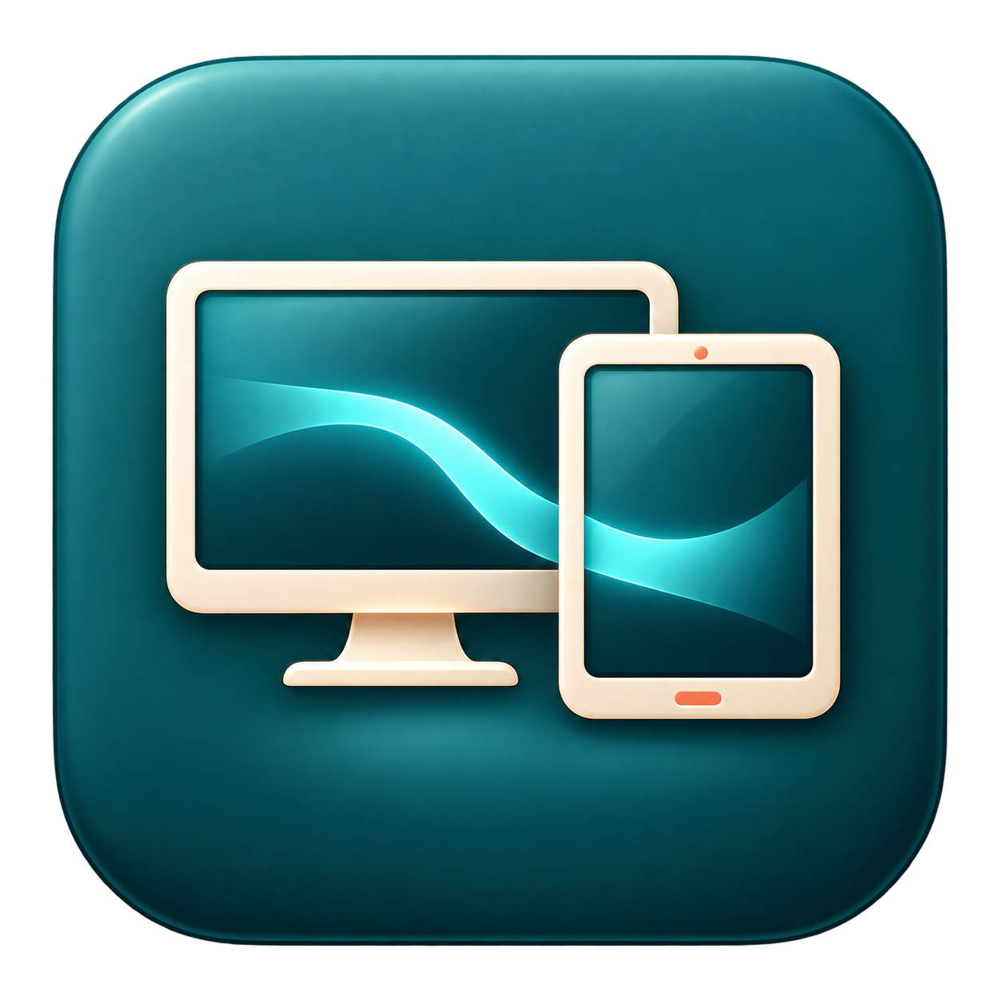

# MtoG



Galaxy Tab을 Mac의 **터치 가능한 확장 디스플레이**로 사용하고, 텍스트·사진·파일을 양방향으로 공유합니다.

## 사용 흐름

1. USB로 연결하고 Galaxy에서 USB 디버깅을 허용합니다.
2. Mac 앱에서 USB 연결 후 최초 한 번 Galaxy의 페어링 코드를 저장합니다.
3. 확장 화면 시작을 누르고 Mac 창을 태블릿 화면으로 옮깁니다. 태블릿 터치로 Mac 앱을 조작합니다.
4. 텍스트는 자동 동기화를 켭니다. 사진·파일은 Mac에서 클립보드 보내기 또는 사진·파일 선택을 사용합니다. Galaxy에서는 기본 공유 메뉴의 **Mac으로 공유 · MtoG**를 선택하거나 클립보드 가져오기를 사용합니다.

기본 화면은 2560×1600, 60Hz 목표입니다. 고화질을 끄면 1920×1200을 사용합니다. 실제 프레임률은 부하에 따라 달라집니다. Mac 화면 기록 권한은 화면 출력, 손쉬운 사용 권한은 터치 입력에 필요합니다.

사진·파일은 한 항목당 최대 24MiB, 자동 텍스트는 UTF-8 262130바이트까지 지원합니다. Galaxy 사진·파일의 자동 백그라운드 클립보드 감지는 제공하지 않습니다. 파일 선택 전송은 원본 바이트와 형식을 유지합니다. Samsung Keyboard를 변경하지 않습니다.

Galaxy → Mac 화면 미러링, Mac 화면 모서리 전환, USB HID와 Android 전용 입력기는 제거했습니다. 기존 페어링·신뢰·클립보드 기록 형식은 유지합니다.

## 개발 및 검증

```sh
./scripts/install-macos-dev.sh
open /Applications/MtoG.app
./scripts/verify-no-device.sh
```

설치 전 실행 중인 MtoG를 종료하세요. 개발 빌드가 변경되면 macOS 권한을 다시 허용해야 할 수 있습니다. 기존 페어링 정보에 대한 키체인 암호 요청이 나오면 macOS 창에서 직접 인증하세요. 앱은 인증 대기 중에도 창을 표시합니다.

Android: `apps/android-companion/gradlew -p apps/android-companion :app:assembleDebug` (JDK 17).

[실기기 검증](docs/device-runs/2026-09-08/README.md) · [진행 기록](docs/refactor-progress.md) · [프로토콜](docs/protocol-v2.md)

## 다운로드 · 0.2.0 시험 릴리스

[릴리스 다운로드](https://github.com/kanghyunmin-bot/MactoGalaxy/releases/tag/v0.2.0)

- macOS 14 이상: DMG 안의 MtoG.app을 응용 프로그램에 복사합니다. Apple Silicon/Intel 유니버설 빌드이며 Developer ID 공증은 없습니다. macOS가 차단하면 개인정보 보호 및 보안에서 실행을 허용해야 합니다.
- Android 12 이상: release APK를 설치합니다. 개발 APK와 서명이 다르면 업데이트 설치가 불가능하므로 기존 앱 데이터를 삭제하지 말고 개발 빌드를 유지하세요.
- Mac에 ADB가 필요합니다 (`brew install android-platform-tools`). 자동 텍스트 공유용 scrcpy 3.3.4 서버는 DMG에 포함됩니다.
- 화면 기록·손쉬운 사용 권한을 허용하세요. 개발 서명이 바뀌면 재승인이 필요할 수 있습니다.

가상 디스플레이는 macOS 비공개 API를 사용합니다. 실제 기기 검증 범위와 남은 항목은 위 실기기 검증 문서를 확인하세요. 전송 암호화를 제공한다고 주장하지 않습니다.
